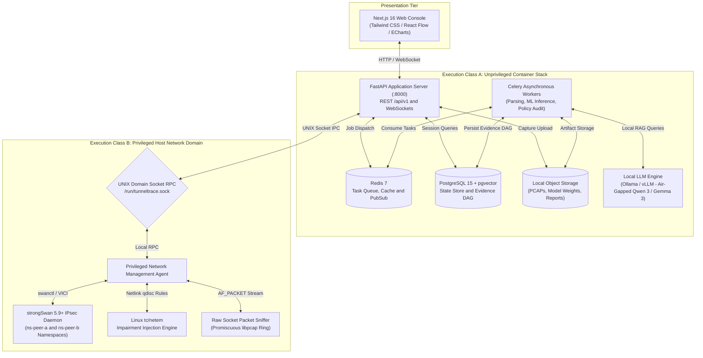
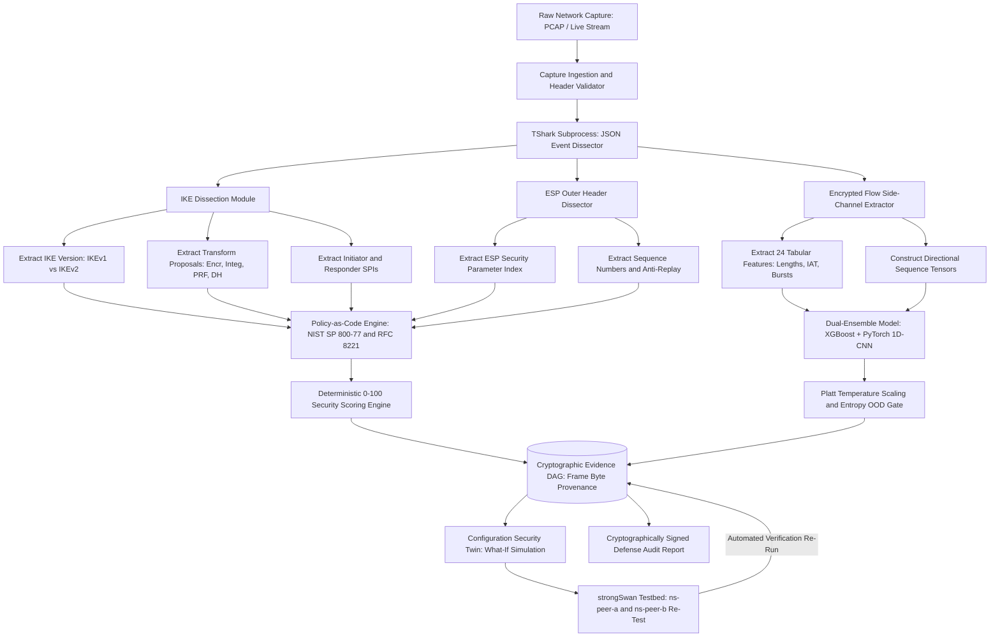
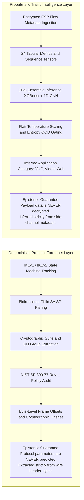
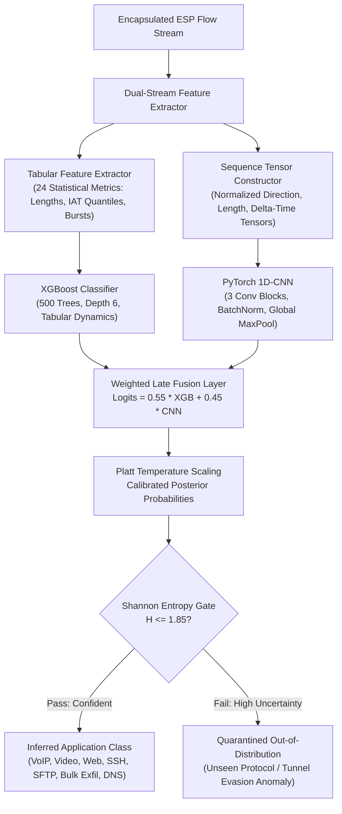
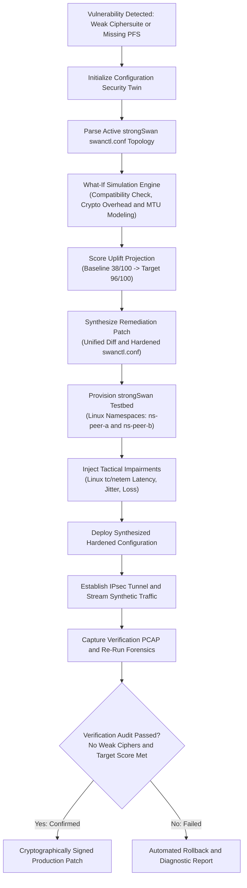

# TunnelTrace AI: IPsec Security Intelligence Platform

<div align="center">

# TunnelTrace AI
### High-Assurance IPsec VPN Protocol Analyzer and Security Assessment Framework
**Smart India Hackathon 2026 -- Problem Statement ID: 26160 (PS 160)**  
**Sponsoring Organization:** National Technical Research Organisation (NTRO)  
**Theme:** Blockchain and Cybersecurity | **Category:** Software  

---

[](LICENSE)
[](PROJECT_MEMORY.md)
[](docs/architecture/DEPLOYMENT.md)
[](docs/architecture/SECURITY_THREAT_MODEL_COMPLIANCE.md)
[](docs/architecture/TRD.md)
[](docs/architecture/SYSTEM_ARCHITECTURE.md)
[-brightgreen.svg)](tests/)
[](docs/architecture/ML_DATASET_ENGINEERING.md)

</div>

---

## Executive Summary

**TunnelTrace AI** is an enterprise-grade, evidence-first **IPsec VPN Protocol Analyzer and Security Assessment Framework** engineered for the **National Technical Research Organisation (NTRO)** under Smart India Hackathon 2026 (Problem Statement ID: `26160`).

Modern national defense agencies, intelligence services, and critical infrastructure operators rely on IPsec tunnels to secure communication enclaves across untrusted or contested wide-area networks. In field operations, these tunnels suffer from systemic security and operational vulnerabilities:
- **Cryptographic Rot:** Silent proliferation of deprecated ciphers (3DES, DES, Blowfish), broken hashing algorithms (MD5, SHA-1), and inadequate Diffie-Hellman groups (DH 1, 2, 5) that fail modern NIST standards.
- **Protocol State Desynchronization:** Misconfigured Perfect Forward Secrecy (PFS), asymmetric Security Association (SA) lifetimes, broken Dead Peer Detection (DPD), and silent rekeying failures causing session dropouts.
- **Encrypted Side-Channel Leakage:** Encapsulated payloads remain ciphertext, yet packet length dynamics, inter-arrival timing bursts, and flow volumes expose inner application behavior (such as VoIP calls, video streams, and bulk data exfiltration) without breaking encryption.
- **Remediation Paralysis:** Network engineers hesitate to update cryptographic policies due to fears of catastrophic tunnel outages on mission-critical links.

**TunnelTrace AI solves this comprehensively.** It ingests raw packet captures (PCAP/PCAPNG) or live network streams, reconstructs deterministic IKEv1/IKEv2 negotiations and bidirectional Child SA states, infers inner application traffic with **zero payload decryption** using a calibrated dual-ensemble ML pipeline, audits observed postures against versioned Policy-as-Code rules (NIST SP 800-77 Rev. 1 / RFC 8221), simulates safe configuration updates in a **Configuration Security Twin**, and validates automated remediations in an isolated, multi-namespace **strongSwan testbed**.

---

## Core System Architecture and Security Boundaries

The platform strictly enforces privilege boundary separation between unprivileged application components (**Execution Class A**) and host-level networking operations (**Execution Class B**) communicating across an authenticated UNIX domain socket.



---

## End-to-End Forensic Processing and Remediation Pipeline

A four-phase pipeline governing trace ingestion, deterministic protocol extraction, side-channel machine learning, policy evaluation, and closed-loop lab verification.



---

## Epistemic Separation: Deterministic Forensics vs. Calibrated ML

The platform maintains an explicit, unbreachable epistemological division between deterministic packet facts (known with mathematical certainty from wire bytes) and probabilistic machine learning predictions (inferred from side channels).



---

## Subsystem Capabilities and Technical Specifications

### 1. Deterministic Protocol Forensics and State Reconstruction
- **IKEv1 and IKEv2 State Machines:** Dissects Main Mode, Aggressive Mode, Quick Mode, `IKE_SA_INIT`, `IKE_AUTH`, and `CREATE_CHILD_SA` exchanges with exact message ID sequencing.
- **Cryptographic Transform Extraction:** Parses every Proposal, Transform, and Attribute structure from SA payloads:
  - Encryption Algorithms (ENCR): AES-GCM (128/256), AES-CBC (128/256), 3DES-CBC, DES, ChaCha20-Poly1305.
  - Integrity Algorithms (INTEG): HMAC-SHA256, HMAC-SHA384, HMAC-SHA512, HMAC-MD5, HMAC-SHA1.
  - Diffie-Hellman Key Exchange Groups (DH): Groups 1, 2, 5, 14, 19, 20, 21, Curve25519.
  - Pseudo-Random Functions (PRF): PRF-HMAC-SHA256, PRF-HMAC-SHA384, PRF-HMAC-MD5.
- **Bidirectional Child SA Pairing:** Binds inbound and outbound Security Parameter Indexes (SPIs) across network endpoints, tracking traffic volume, packet counts, and lifetime expirations.
- **NAT-Traversal Tracking:** Dissects UDP encapsulation on port 4500 (RFC 3948), Non-ESP markers, and keepalive packet streams.

### 2. Encrypted Traffic Intelligence (Zero Payload Decryption)
- **Zero Decryption Guarantee:** Conforms to defense data governance mandates. The platform inspects only outer IP/UDP/ESP headers, packet lengths, directionality, and inter-arrival timing dynamics.
- **24 Tabular Side-Channel Features:** Computes burst density, packet size skewness, kurtosis, coefficient of variation, bidirectional volume ratios, and inter-arrival time quantiles.
- **Dual-Ensemble Architecture:** Combines gradient-boosted decision trees (**XGBoost**) for tabular feature dynamics with a **PyTorch 1D-CNN** for temporal packet sequence modeling.
- **Platt Temperature Calibration:** Mitigates uncalibrated neural overconfidence, ensuring displayed confidence scores reflect empirical posterior probabilities.
- **Shannon Entropy Out-of-Distribution Gating:** Quarantines unknown or evasion traffic when prediction entropy exceeds $H = 1.85$, preventing false alarms on unmodeled zero-day protocols.



### 3. Policy-as-Code and Deterministic Security Scoring
- **Authoritative Cryptographic Standards:** Evaluates sessions against machine-readable YAML rules codifying **NIST SP 800-77 Rev. 1**, **RFC 8221**, **RFC 7296**, and **FIPS 140-3**.
- **Deterministic 0-100 Scoring Formula:**
  $$S = \max\left(0, 100 - \sum \text{Severity Deductions} + \text{Bonuses}\right)$$
  - **Cryptographic Suite (40%):** Deductions for broken ciphers (3DES: -35), weak DH groups (DH 2: -25), deprecated hashes (SHA-1: -20).
  - **Protocol Hygiene and Key Exchange (25%):** Penalties for disabled PFS (-15), aggressive mode usage (-20), missing DPD (-10).
  - **Identity and Authentication (20%):** Auditing PSK entropy and X.509 certificate trust chains.
  - **Operational Posture (15%):** SA lifetime configuration and rekeying grace period audits.
- **Evidence-Grounded Scores:** When an analysis has unassessed policy dimensions (for example, missing IKE context in an ESP-only capture), the system explicitly flags the posture score as assessing observed rules only, preventing false assurances of security.

### 4. Configuration Security Twin and Remediation Testbed
- **Headless Virtual Clone:** Ingests active strongSwan (`ipsec.conf` / `swanctl.conf`) configurations and models them in a virtual state machine.
- **What-If Impact Simulator:** Projects the consequence of ciphersuite upgrades prior to touching production hardware:
  - Validates compatibility against remote peer capabilities.
  - Calculates cryptographic computational overhead and throughput impact.
  - Detects potential Path MTU (PMTU) and ESP fragmentation hazards.
- **Multi-Namespace strongSwan Lab:** Provisions isolated Linux network namespaces (`ns-peer-a` and `ns-peer-b`) interconnected via virtual Ethernet pairs.
- **Tactical Impairment Injection:** Employs Linux `tc` / `netem` to inject real-world network latency (10-500ms), packet jitter, packet loss (0.1-15%), and packet reordering.
- **Closed-Loop Verification:** Automatically applies synthesized remediation configurations, establishes live IPsec tunnels, streams synthetic workloads, records verification captures, and audits compliance.



### 5. Grounded AI Cryptographic Analyst
- **100% Offline and Sovereign:** Operates locally via Ollama with quantized open-weight models (Qwen 3 4B / Gemma 3 4B). No prompts or embeddings leave the local security enclave.
- **Deterministic Citation Fast-Path:** Employs an exact forensic synthesizer that analyzes protocol parameters directly from the Evidence DAG, citing exact SA IDs (`[sa:ike:...]`), transform algorithms, and Child SA contexts in under 20 seconds.
- **Local RAG Fallback:** Queries vector embeddings of authoritative RFC standards (RFC 7296, RFC 8221, RFC 4301, NIST SP 800-77 Rev. 1) to answer contextual questions with mandatory standards citations.
- **Strict Guardrails:** System prompts prevent the AI analyst from asserting unobserved vulnerabilities, hallucinating frame numbers, or contradicting deterministic policy findings.

### 6. Distributed Edge Gateway Collector (`scripts/gateway_collector.py`)
- **Lightweight Remote Telemetry:** Monolithic, zero-dependency Python script deployable to edge gateways and perimeter Linux routers.
- **BPF Filtering:** Captures strictly IPsec traffic (`udp port 500 or udp port 4500 or proto esp`) to protect router resources.
- **Rotating Ring Buffers:** Manages rolling PCAP captures using TShark (`-b filesize -b files`) or tcpdump (`-C -W`) ring buffers to prevent storage exhaustion.
- **FIFO Quota Retention:** Automatically prunes old captures exceeding configured count or size limits, maintaining a local tamper-evident `capture_manifest.json`.
- **Protected Sensor Authentication:** Resolves sensor tokens from environment variables, command-line arguments, or permission-restricted token files (`--token-file`) to prevent process-list token leakage.
- **Non-Root Mock Mode:** Includes structured mock telemetry generation enabling end-to-end demonstrations on development workstations without root privileges.

---

## Competitive Differentiation Matrix

| Evaluation Vector | Traditional Sniffers (Wireshark / tcpdump) | Generic SIEMs (Splunk / QRadar) | Black-Box Anomaly Detectors | TunnelTrace AI (SIH 2026 / NTRO) |
| :--- | :--- | :--- | :--- | :--- |
| **IKE/ESP State Reconstruction** | Manual packet inspection; no session graph | Log-based only; blind to wire-level protocol state | Opaque embeddings; cannot reconstruct SA states | **Automated, deterministic IKEv1/IKEv2 and ESP state machines** |
| **Encrypted Flow Visibility** | Blind beyond ESP header (requires private keys) | None; relies on host endpoint agents | Uncalibrated anomaly scores; high false-positive rate | **Dual-ensemble ML (XGBoost + 1D-CNN) with zero decryption** |
| **Out-of-Distribution Gating** | Not applicable | Rule-based threshold alerts | Fails silently on unseen zero-day traffic | **Shannon entropy gating (H <= 1.85) + Platt scaling** |
| **Regulatory Compliance** | Manual inspection against printed standards | Generic CIS/ISO compliance templates | No compliance mapping | **Native NIST SP 800-77 Rev. 1 and RFC 8221 Policy-as-Code** |
| **Evidence Provenance** | Individual frame numbers | Aggregated log indices | None (black-box latent vector) | **Cryptographic Evidence DAG linked to raw byte offsets** |
| **Remediation Safety** | Manual CLI editing on live routers | Script push without validation | Automated actions risk breaking live tunnels | **What-If Configuration Twin + Closed-Loop Lab Re-Test** |
| **Deployment Model** | Desktop utility | Heavy cloud infrastructure | Proprietary cloud SaaS | **100% Local-First, air-gapped container stack** |

---

## Technology Stack

| Architecture Layer | Technology Selection | Exact Version | Rationale and Responsibility |
| :--- | :--- | :--- | :--- |
| **Presentation Tier** | Next.js / TypeScript | `16.3+` / `5.4+` | Server-rendered React framework with Turbopack, typed DTO contracts |
| **Styling and UI System** | Tailwind CSS / Lucide | `3.4+` | High-density tactical SOC layout, dark-mode native interface |
| **Topology Visualizer** | React Flow / Dagre | `11.11+` | Interactive IKE/ESP Security Association state graphs and Evidence DAG |
| **Charts and Metrics** | Apache ECharts | `5.5+` | High-performance canvas charting for traffic bursts and confidence distributions |
| **Backend API Gateway** | FastAPI (Python) | `0.110+` | Asynchronous ASGI gateway, OpenAPI autogeneration, Pydantic v2 validation |
| **Data Serialization** | Pydantic | `v2.6+` | Contract-first DTO schemas, strict validation, zero-copy serialization |
| **Task Queue and Broker** | Celery / Redis | `5.3+` / `7.2+` | Distributed task execution for heavy PCAP parsing, ML inference, and reports |
| **Relational Database** | PostgreSQL / SQLite | `15.6+` / `3.45+` | Relational state store, temporal session indexing, SQLite dev support |
| **Vector Search Engine** | pgvector extension | `0.6+` | High-dimensional embedding storage for RFC documents and RAG queries |
| **Protocol Forensics** | TShark / Scapy | `4.2+` / `2.5+` | Low-level C-based wire dissection, frame offset extraction, packet parsing |
| **ML: Gradient Boosting** | XGBoost | `2.0+` | Inference over 24 tabular statistical side-channel features |
| **ML: Deep Learning** | PyTorch | `2.2+` | 1D-CNN temporal sequence modeling over packet length and timing tensors |
| **Explainable AI (XAI)** | TreeSHAP | `0.44+` | Local feature attribution explaining encrypted flow classification |
| **Local LLM Runtime** | Ollama | `0.1.30+` | 100% offline, air-gapped natural language inference (Qwen 3 / Gemma 3) |
| **VPN Testbed Daemon** | strongSwan | `5.9.13+` | Standard-compliant IKEv1/IKEv2 daemon supporting custom crypto suites |
| **Traffic Emulation** | Linux iproute2 / tc | Kernel 5.15+ | Multi-namespace routing (veth), latency, jitter, and loss injection |
| **Report Generation** | WeasyPrint / Jinja2 | `61.0+` | Cryptographically signed, audit-grade executive and technical PDF reports |

---

## Repository Structure

```
TunnelTrace-AI/
├── .github/                       # CI/CD Workflows and GitHub Actions
├── backend/                       # FastAPI Server and Analysis Core
│   ├── alembic/                   # Database Migrations
│   ├── app/                       # Application Core
│   │   ├── ai/                    # Grounded AI Analyst and RAG Engine
│   │   ├── api/v1/                # REST API Routers (analyses, lab, system, etc.)
│   │   ├── capture/               # Capture Ingestion and Header Parsing
│   │   ├── core/                  # Configuration, Settings, and Logging
│   │   ├── db/                    # SQLAlchemy ORM Models and Session Engine
│   │   ├── ml/                    # XGBoost and 1D-CNN Inference Engines
│   │   ├── protocol/              # TShark Protocol Dissectors
│   │   ├── reconstruction/        # IKE and Child SA State Graph Trackers
│   │   ├── remediation/           # Configuration Twin and Closed-Loop Runner
│   │   ├── reporting/             # PDF and JSON Forensic Report Generators
│   │   └── security/              # Policy-as-Code Engine and 0-100 Scoring
│   └── tests/                     # Backend Unit and Integration Test Suite (514 tests)
├── frontend/                      # Next.js 16 Web Application
│   ├── src/
│   │   ├── app/                   # App Router Pages (14 verified routes)
│   │   ├── components/            # Reusable UI, Charts, and SOC Layouts
│   │   └── lib/                   # API Client, Types, Context Providers
│   └── public/                    # Static Assets, Icons, and PWA Manifest
├── knowledge/                     # Authoritative Standards Reference Base
│   └── standards/                 # RFC 7296, RFC 8221, NIST SP 800-77 Markdowns
├── lab/                           # strongSwan Testbed and Privileged Agent
│   ├── agent/                     # Class B Privileged Network Daemon
│   ├── scenarios/                 # Test Scenario Profiles (AES-GCM, 3DES, Impairments)
│   └── workloads/                 # Synthetic Traffic Generators (VoIP, Video, OOD)
├── models/                        # Calibrated ML Model Artifacts
│   └── active/                    # Manifest, Schema, Weights, and Calibration Config
├── policies/                      # Policy-as-Code Definitions (YAML)
│   └── rules/                     # NIST SP 800-77 and RFC 8221 Policy Rules
├── scripts/                       # Operational, Audit, and Collector Scripts
│   ├── gateway_collector.py       # Distributed Edge Gateway Telemetry Collector
│   ├── demo_health.py             # Pre-Demonstration Health Check Script
│   ├── demo_reset.py              # Demonstration State Reset Utility
│   └── build_verification_fixtures.py # Automated Test Fixture Generator
├── tests/                         # Root Test Suite (75 tests)
│   ├── fixtures/                  # PCAP/PCAPNG Captures and Edge Cases
│   ├── integration/               # Multi-Stage Integration Test Suites
│   └── unit/                      # Component Unit Tests
├── docker-compose.yml             # Class A Container Stack Specification
├── docker-compose.lab.yml         # Class B Lab Orchestration Specification
├── pytest.ini                     # Pytest Execution Configuration
└── README.md                      # Primary Repository Overview and Architecture Guide
```

---

## Quickstart and Local-First Deployment

TunnelTrace AI is designed for local, air-gapped operation on standard x86_64 workstations without requiring external cloud accounts or internet connectivity.

### System Prerequisites
- **Operating System:** Linux (Ubuntu 22.04 LTS recommended) or Windows 11 with WSL2 / Native Python.
- **CPU and RAM:** Minimum 4 Cores, 8 GB RAM (16 GB recommended for local LLM inference).
- **Python:** Python 3.10 or 3.11 with `pip`.
- **Node.js:** Node.js 18.x, 20.x, or 22.x with `npm`.
- **Packet Dissector:** TShark 4.0+ installed and on system PATH.
- **Local LLM Engine:** Ollama with `qwen3:4b-instruct-2507-q4_K_M` or `gemma3:4b`.

---

### Step 1: Clone the Repository
```bash
git clone https://github.com/sharancode3/TunnelTrace-AI.git
cd TunnelTrace-AI
```

### Step 2: Configure Environment Variables
```bash
cp .env.example .env
# Default configuration is pre-tuned for local air-gapped operation
```

### Step 3: Install Dependencies

#### Python Backend
```bash
python -m pip install -r backend/requirements.txt
```

#### Next.js Frontend
```bash
cd frontend
npm install
cd ..
```

---

### Step 4: Run the Automated Test Suite (589 Tests)

Verify the complete platform integrity across all 589 automated tests:

```bash
# 1. Run root integration and unit test suite (75 tests)
pytest tests -v

# 2. Run backend test suite (514 tests)
pytest backend/tests -v

# 3. Verify frontend static types
cd frontend && npx tsc --noEmit && cd ..
```

*Expected Result: All 589 tests pass with 0 failures.*

---

### Step 5: Launch Local Services

#### Terminal 1: Backend Application Server
```bash
python run_backend.py
# Backend API active at http://127.0.0.1:8002
# Interactive API documentation: http://127.0.0.1:8002/docs
```

#### Terminal 2: Frontend Web Console
```bash
cd frontend
npm run dev -- -p 3002
# Frontend console active at http://localhost:3002
```

#### Terminal 3: (Optional) Distributed Edge Gateway Collector
```bash
# Run mock collector for testing without root
python scripts/gateway_collector.py --mock --api-url http://127.0.0.1:8002/api/v1 --interval 10

# Or run live on Linux router with root privileges
sudo python3 scripts/gateway_collector.py \
    --interface eth0 \
    --api-url http://127.0.0.1:8002/api/v1 \
    --token-file /etc/tunneltrace/sensor.token \
    --pcap-max-files 5 \
    --pcap-max-mb 50
```

---

### Step 6: Verify Service Health

Query the live readiness and liveness diagnostic probes:

```bash
# Query application liveness
curl -s http://127.0.0.1:8002/api/v1/system/health/live

# Query comprehensive dependency readiness (DB, Storage, TShark, ML)
curl -s http://127.0.0.1:8002/api/v1/system/health/ready
```

Expected JSON response structure:
```json
{
  "status": "READY",
  "dependencies": {
    "database": { "status": "UP", "engine": "sqlite" },
    "storage": { "status": "UP", "writable": true },
    "tshark": { "status": "UP", "version": "4.6.4" },
    "ml_engine": { "status": "UP", "bundle_version": "v1.0.0-experimental", "artifact_state": "VERIFIED_ACTIVE" }
  }
}
```

---

## Golden SIH 2026 Demonstration Walkthrough

The following 12-step sequence constitutes the primary evaluation walkthrough designed for NTRO evaluators:

| Step | Action | Execution Details | Expected Evaluation Output |
| :---: | :--- | :--- | :--- |
| **01** | **System Health Audit** | Navigate to `/` or query `/health/ready` | All core dependencies green; DB, Storage, TShark, ML active |
| **02** | **Capture Ingestion** | Upload `real_tunnel_gcm.pcapng` at `/analyses/new` | Ingestion complete in < 2.5s; SHA-256 hash locked in custody |
| **03** | **Deterministic Forensics** | TShark extracts IKEv2 negotiations and Child SAs | Bidirectional SPIs paired; AES-GCM-256 and DH 19 isolated |
| **04** | **Policy Compliance Audit** | Policy engine evaluates NIST SP 800-77 rules | All assessed rules evaluated against RFC 8221 / NIST |
| **05** | **Security Scoring** | Algorithm computes baseline score | Posture score displayed with exact assessed rule coverage |
| **06** | **Encrypted Flow ML** | Dual ensemble infers traffic category | Inferred flow classified or gated to OOD with calibrated confidence |
| **07** | **Evidence DAG Inspection** | Drill into finding in the Web Console | UI highlights exact packet frame numbers, bytes, and offsets |
| **08** | **AI Analyst Fast-Path** | Navigate to `/analyses/[id]/ai-analyst` | Grounded synthesis resolves SA cryptographic facts in < 20s |
| **09** | **Configuration Twin** | Launch Configuration Security Twin | Proposes hardened `swanctl.conf` configuration with score uplift |
| **10** | **Testbed Closed-Loop Test** | Click "Verify in Lab Testbed" | Agent provisions `ns-peer-a`, establishes tunnel, streams packets |
| **11** | **Delta Score Verification** | System captures fresh verification PCAP | Automated re-audit confirms target posture score achieved |
| **12** | **Executive Report Export** | Click "Export Signed Defense Report" | Generates audit-grade PDF report with full cryptographic provenance |

---

## Regulatory Compliance and RFC Standards Matrix

TunnelTrace AI natively implements and verifies compliance against the following official standards:

| Standard / RFC | Document Title | TunnelTrace AI Implementation Scope |
| :--- | :--- | :--- |
| **NIST SP 800-77 Rev. 1** | *Guide to IPsec VPNs* | Authoritative ruleset for cipher suites, hash functions, and DH key sizes |
| **RFC 8221** | *Cryptographic Algorithm Implementation Requirements for ESP/AH* | Categorization of MUST, SHOULD, and MUST NOT cryptographic algorithms |
| **RFC 7296** | *Internet Key Exchange Protocol Version 2 (IKEv2)* | Full state machine tracking, exchange parsing, and notification dissection |
| **RFC 4301** | *Security Architecture for the Internet Protocol* | Security Association (SA) and Security Policy Database (SPD) modeling |
| **RFC 4303** | *IP Encapsulating Security Payload (ESP)* | ESP header parsing, sequence counter tracking, and anti-replay verification |
| **RFC 3948** | *UDP Encapsulation of IPsec ESP Packets* | NAT-Traversal (NAT-T) port 4500 detection and SPI preservation |
| **FIPS 140-3** | *Security Requirements for Cryptographic Modules* | Validation of approved cryptographic primitives and key derivation |
| **NSA CNSA Suite** | *Commercial National Security Algorithm Suite* | Quantum-resistant cryptographic migration recommendations (AES-256 / DH 19/21) |

---

## Security Governance, Non-Repudiation, and Defense Controls

### Privilege Isolation (Class A vs. Class B)
- **Execution Class A (Unprivileged):** The Web Console, FastAPI Gateway, Celery Workers, Redis, and Database run as unprivileged service accounts. They have zero access to raw network sockets or host interfaces.
- **Execution Class B (Privileged Agent):** The privileged strongSwan daemon and packet capture engine run exclusively within a dedicated host-level daemon communicating with Class A exclusively over an authenticated, permission-restricted UNIX domain socket.

### Zero Payload Decryption
TunnelTrace AI does not perform Man-in-the-Middle (MitM) TLS/ESP termination, does not solicit private cryptographic keys from administrators, and does not reconstruct plaintext application payloads. All application traffic intelligence is derived exclusively from side-channel statistical metadata (packet sizes, timing, bursts).

### Air-Gapped Operation / Zero External Egress
The entire platform operates 100% offline. No telemetry, crash reports, packet fragments, or embeddings are ever transmitted outside the host machine. The integrated RAG AI Analyst operates against locally hosted language models running in memory via Ollama.

### Immutable Chain of Custody
Every packet capture uploaded to the platform is hashed with SHA-256 upon arrival. All downstream findings, protocol observations, and compliance deductions store explicit references to this SHA-256 hash, ensuring court-admissible non-repudiation in forensic investigations.

---

## Problem Statement Attribution

- **Competition:** Smart India Hackathon (SIH) 2026, Grand Finale
- **Problem Statement ID:** `26160` (Internal Reference: PS 160)
- **Title:** AI-Powered IPsec VPN Protocol Analyzer and Security Assessment Framework
- **Sponsoring Agency:** **National Technical Research Organisation (NTRO)**
- **Theme:** Blockchain and Cybersecurity
- **Category:** Software
- **Target Users:** Defense SOC Analysts, Intelligence Protocol Engineers, Military Communications Auditors, Critical Infrastructure Network Operators

---

## License and Intellectual Property

This project is licensed under the **Apache License, Version 2.0**. See the [LICENSE](LICENSE) file for complete terms.

```
Copyright 2026 TunnelTrace AI Contributors (SIH 2026 Team)

Licensed under the Apache License, Version 2.0 (the "License");
you may not use this file except in compliance with the License.
You may obtain a copy of the License at

    http://www.apache.org/licenses/LICENSE-2.0
```
